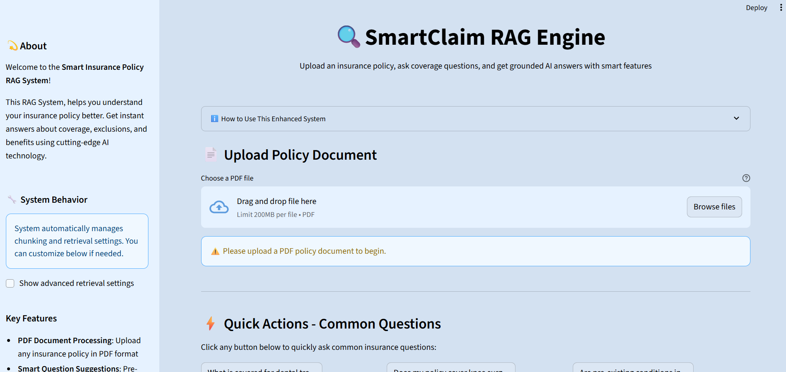

# SmartClaim RAG Engine – AI-Powered Insurance Policy Analysis

An intelligent system that makes insurance policies **clear, searchable, and actionable** using AI-powered retrieval and clause-backed answers.

## 🚀 Overview

SmartClaim is an end-to-end AI system that transforms how you interact with insurance policies:

- **Process insurance policy PDFs** with high accuracy text extraction
- **Get instant answers** using Retrieval-Augmented Generation (RAG) 
- **Receive detailed decisions** with reasoning, payout estimates, and clause references
- **Access quick tools** for bookmarks, search history, and PDF report export
- **Bridge AI research** with practical insurance decision support

## ✨ Core Features

| Feature | Description |
|---------|-------------|
| 📄 **PDF Document Processing** | Extracts policy text with high accuracy using PyMuPDF |
| 🧠 **Semantic Search (FAISS)** | Finds the most relevant clauses to answer your questions |
| 🤖 **AI Answer Generation** | Gemini-powered responses grounded in original policy text |
| 🔍 **Comprehensive Analysis** | Provides decision, reasoning, and payout information |
| ⚡ **Quick Actions** | Pre-built common insurance questions for faster queries |
| 🔖 **Smart Organization** | Bookmark important insights and track search history |
| 📑 **PDF Report Export** | Generate professional summaries for offline use |
| 🛠 **Customizable Settings** | Adjust chunk size and retrieval depth for optimal results |

## 📷 Application Preview

### Dashboard  
  
*Clean, intuitive main interface for policy analysis*

### Policy Upload & Processing  
  
*Seamless PDF upload with real-time processing status*

### Clause-Backed Answers  
  
*Detailed decisions with reasoning and source clause references*

### Professional Reports  
  
*Downloadable PDF reports for documentation*

## 🎥 Demo

> 📹 [Watch Demo Video](https://drive.google.com/file/d/1-EPfmjlGsvri_X5K37Cu_spzOU5wFxZe/view?usp=sharing) <br>
> 💫 [Try Live Demo](#)

## 🏗️ Architecture

### How It Works

1. **Upload Policy PDF** → System extracts text using PyMuPDF
2. **Text Chunking** → Splits content into meaningful, searchable sections  
3. **Embedding Generation** → Google embedding-001 converts chunks to vectors
4. **Vector Search** → FAISS finds the most relevant chunks for your query
5. **AI Generation** → Gemini produces decisions with reasoning and references
6. **User Tools** → Access quick questions, bookmarks, and export options

### Tech Stack

| Component | Technology |
|-----------|------------|
| **Frontend/UI** | Streamlit (Python) |
| **Backend Logic** | Python |
| **PDF Processing** | PyMuPDF |
| **Vector Search** | FAISS |
| **AI Embeddings** | Google Generative AI embedding-001 |
| **Generative Model** | Gemini 1.5 Flash |
| **Report Generation** | ReportLab |

## 📂 Project Structure

```
smartclaim-rag-engine/
├── app.py                 # Main Streamlit application
├── requirements.txt       # Python dependencies
├── README.md             # Project documentation
├── .gitignore            # Git ignored files
├── screenshots/          # UI preview images
│   ├── dashboard.png
│   ├── upload.png
│   ├── answer.png
│   └── report.png
└── data/                 # Sample insurance policies
    └── sample_policy.pdf
```

## 🚀 Quick Start

### Prerequisites
- Python 3.8+
- Google Generative AI API key

### Installation

1. **Clone the repository**
   ```bash
   git clone https://github.com/yourusername/smartclaim-rag-engine
   cd smartclaim-rag-engine
   ```

2. **Create virtual environment**
   ```bash
   python -m venv .venv
   
   # On macOS/Linux:
   source .venv/bin/activate
   
   # On Windows:
   .venv\Scripts\activate
   ```

3. **Install dependencies**
   ```bash
   pip install -r requirements.txt
   ```

4. **Set up API key**
   ```bash
   # On macOS/Linux:
   export GENAI_API_KEY=your_google_api_key_here
   
   # On Windows:
   set GENAI_API_KEY=your_google_api_key_here
   ```

5. **Run the application**
   ```bash
   streamlit run app.py
   ```

6. **Open your browser** to `http://localhost:8501`

## 🔑 API Key Setup

To get your Google Generative AI API key:

1. Visit [Google AI Studio](https://aistudio.google.com/app/apikey)
2. Create a new API key
3. Copy and set it as an environment variable (see step 4 above)

## 📋 Usage Examples

### Common Insurance Questions
- "What is my coverage limit for water damage?"
- "Am I covered for theft outside my home?"
- "What is the deductible for auto collision?"
- "Does my policy cover natural disasters?"

### Advanced Queries
- "What are the exclusions for pre-existing conditions?"
- "How does the policy handle depreciation for electronics?"
- "What documentation is required for filing a claim?"

## 🤝 Contributing

We welcome contributions! Please follow these steps:

1. Fork the repository
2. Create a feature branch (`git checkout -b feature/amazing-feature`)
3. Commit your changes (`git commit -m 'Add amazing feature'`)
4. Push to the branch (`git push origin feature/amazing-feature`)
5. Open a Pull Request

## 📄 License

This project is licensed under the MIT License - see the [LICENSE](LICENSE) file for details.

You may use, modify, and distribute this software for personal or commercial purposes, provided you credit the original author.

## 👩‍💻 Author

**Prerita Saini** - [GitHub Profile](https://github.com/preritasaini1)

## ✨ Acknowledgments

- Inspired by state-of-the-art retrieval-augmented generation research
- Powered by Google Generative AI & FAISS
- Built with the Streamlit community's amazing tools and resources

---

<div align="center">

**Made with ❤️ to make insurance policy understanding simple, transparent, and accessible for everyone.**

⭐ If this project helped you, please give it a star!

</div>
